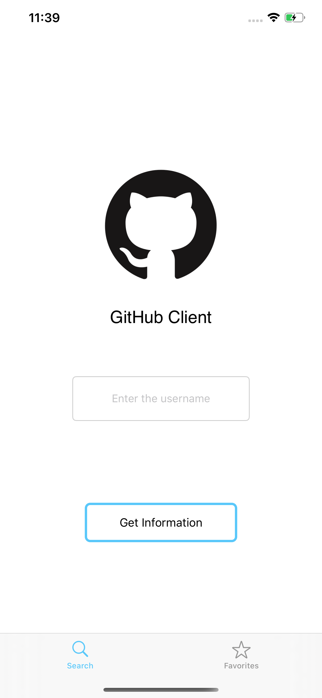
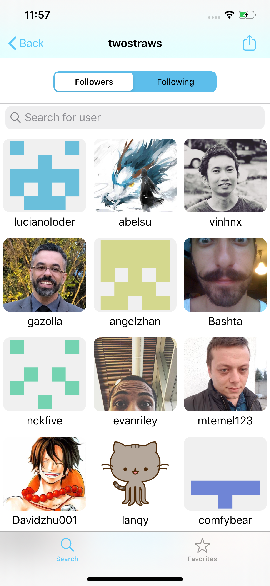
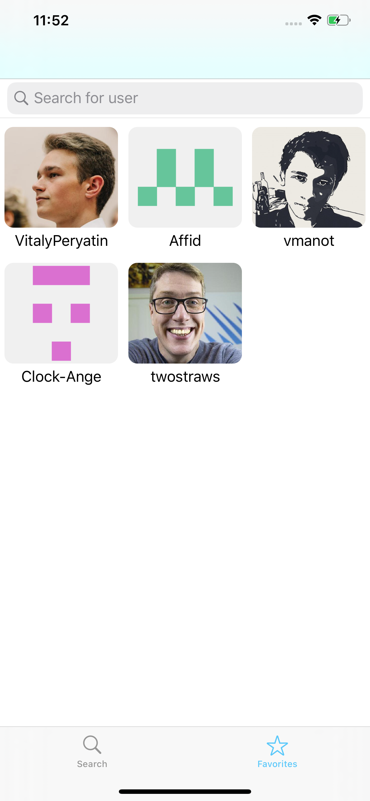
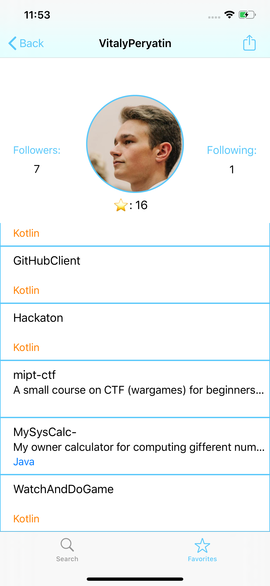

# GitHubClient
Current project might be the first serious one on my GitHub account. It's purpose is to show skills that I learned so far as an iOS Developer.

# Screenshots

{:height="50%" width="50%"}
{:height="50%" width="50%"}
{:height="50%" width="50%"}
{:height="50%" width="50%"}
